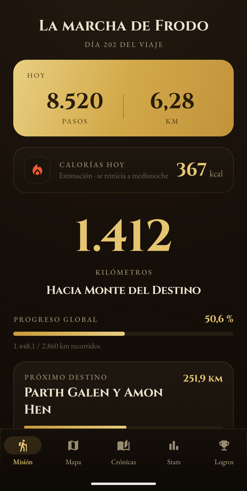
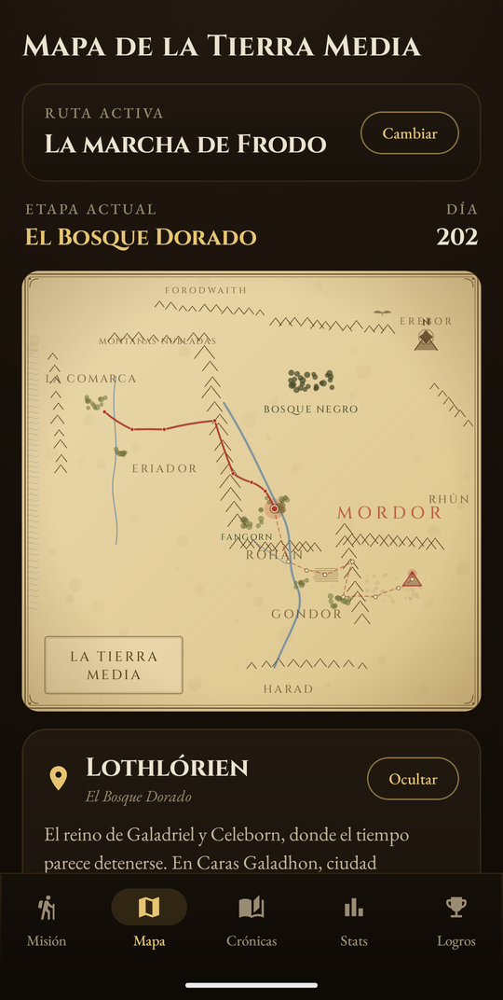
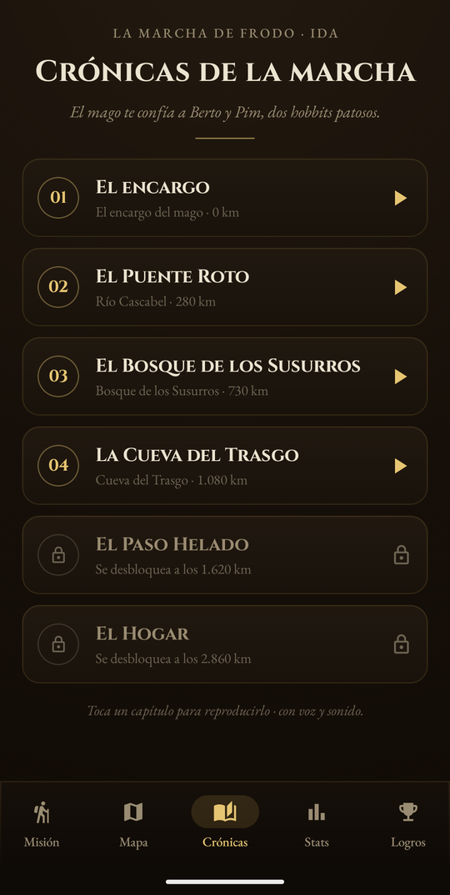
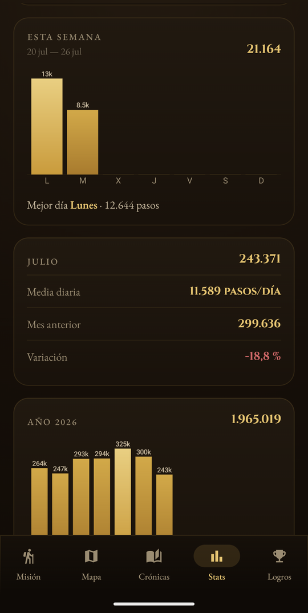
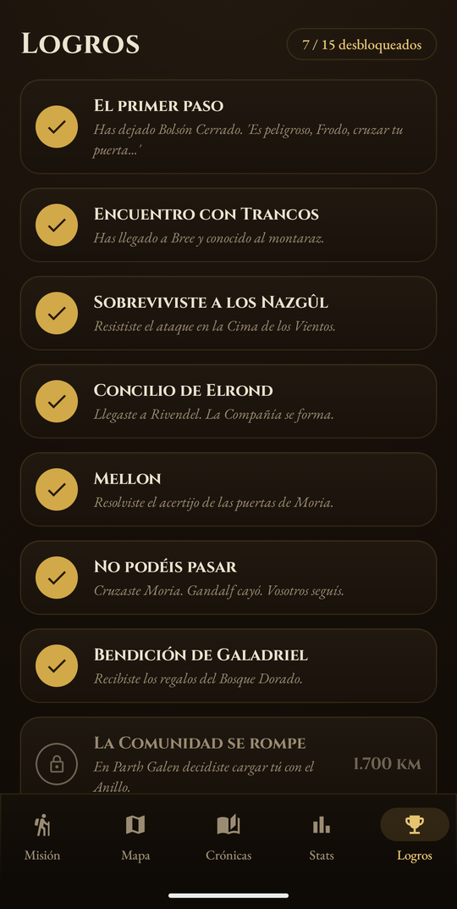
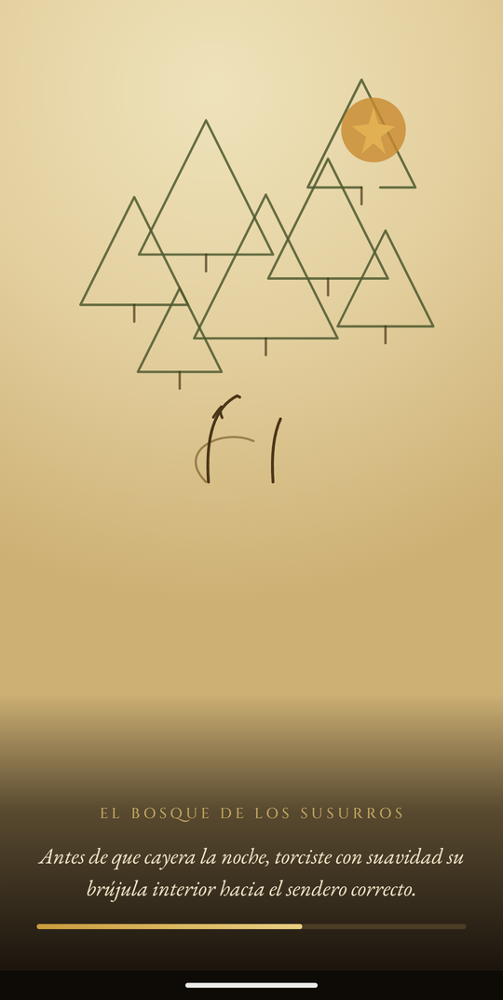

# Middle Earth Journey

App personal que convierte tus **pasos diarios** en avance por una **ruta de la Tierra
Media** (El Señor de los Anillos / El Hobbit). Cada paso real te acerca a tu destino. No
hay competición: es un viaje personal con tono de diario. Todo el texto está en **español**.

## Capturas

| Misión | Mapa | Crónicas | Stats | Logros |
|:---:|:---:|:---:|:---:|:---:|
|  |  |  |  |  |
| Pasos de hoy y progreso | Carta de la Tierra Media | Capítulos narrados | Semana, mes y año | 7 / 15 desbloqueados |

Y las **cinemáticas**, que se dibujan trazo a trazo sobre pergamino mientras la voz narra:



> Capturas tomadas en un emulador con un viaje de ejemplo (202 días, ~1,96 M de pasos),
> no con datos reales.

## Descargar (Android)

**➡️ [Descargar APK — v1.1](https://github.com/marcmayol/middle_earth_journey/releases/latest)**

Descarga el archivo `.apk` desde la [última release](https://github.com/marcmayol/middle_earth_journey/releases/latest)
e instálalo en el móvil (Android 8+). Necesitarás activar *"instalar apps de origen desconocido"*.

A partir de la v1.1 la app **se actualiza sola**: consulta el manifiesto publicado y te
avisa cuando hay versión nueva.

> ⚠️ **Si vienes de la v1.0 (debug), tu viaje no se traslada solo.** Aquella iba firmada
> con otra clave y con `applicationId` distinto (sufijo `.debug`), así que para Android
> son **dos apps diferentes**: la v1.1 se instala al lado, empezando de cero, y
> desinstalar la vieja se lleva por delante los pasos acumulados. Si te importa el
> progreso, **migra los datos antes de desinstalar nada** (el estado vive en el DataStore
> `frodo_steps` de la app antigua).

## Qué hace

- Cuenta los pasos del día (podómetro del sistema) y los convierte en kilómetros
  (1 paso ≈ 0,7 m), avanzando por una ruta con sus hitos.
- **Dos rutas**, con ida y vuelta: *La marcha de Frodo* (→ Monte del Destino, 2.860 km) y
  *Ida y vuelta de Bilbo* (→ Erebor, 1.500 km).
- **5 secciones:** Misión, Mapa (carta ilustrada de la Tierra Media), Crónicas
  (cinemáticas), Stats (gráficas) y Logros.
- **Cinemáticas narradas**: line-art que se dibuja sobre pergamino + voz (TTS) + subtítulos,
  desbloqueadas por etapa.
- **Sucesos aleatorios** del camino (cada ~5 días, tras andar 3 km), con notificación.
- Estética "códice": dorado sobre fondo oscuro, tipografías Cinzel + EB Garamond.

## Estado / ramas

- **`master`** — App **Android nativa funcional** (Kotlin + Jetpack Compose + Material 3).
  Compila y corre. Es la referencia de comportamiento.
- **`kmp-migration`** — Migración en curso a **Kotlin / Compose Multiplatform** (Android +
  iOS). La estructura está montada; falta convertir el código compartido y escribir el lado
  iOS. **Ver [`MIGRATION.md`](MIGRATION.md)** para el detalle de lo que queda.

## Compilar la app Android (rama `master`)

Requisitos: JDK 17, Android SDK (compileSdk 34), un dispositivo/emulador con Android 8+ (minSdk 26).

```bash
git checkout master
./gradlew :app:assembleDebug
# APK en: app/build/outputs/apk/debug/app-debug.apk
adb install -r app/build/outputs/apk/debug/app-debug.apk
```

> En la rama `kmp-migration` el módulo es `:composeApp` (no `:app`), y el objetivo es que
> `./gradlew :composeApp:assembleDebug` (Android) y el proyecto Xcode `iosApp` (iPhone)
> compilen desde el mismo código. Ver `MIGRATION.md`.

## Stack

- **Compartido (objetivo KMP):** Jetpack/Compose Multiplatform (UI), lógica de viaje,
  rutas, logros, sucesos, cinemáticas.
- **Android:** sensor `TYPE_STEP_COUNTER`, servicio en primer plano + notificaciones,
  `TextToSpeech`, persistencia.
- **iOS (a implementar):** `CMPedometer` (pasos), `AVSpeechSynthesizer` (voz),
  `UNUserNotificationCenter` (avisos).

App personal, no publicada en tiendas; instalación por sideload (Android) y compilación
desde Xcode (iOS).
